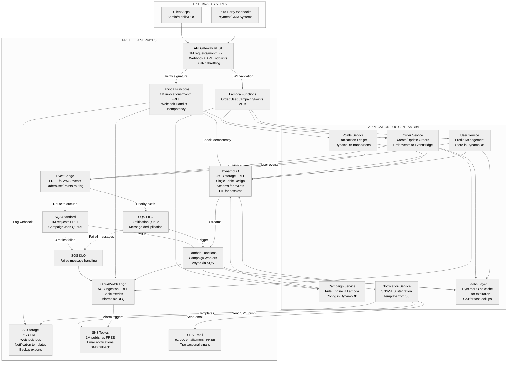

# Loyalty & Rewards System

A **serverless**, **event-driven**, and **type-safe** loyalty and rewards platform built on **AWS Free Tier** services using **Node.js (20.x)** and **TypeScript**.  
Designed for businesses to manage customer loyalty programs, points tracking, automated campaigns, and multi-channel notifications — all optimized for scalability and zero-cost prototyping.

[](https://aws.amazon.com/free/)
[](https://aws.amazon.com/serverless/)
[](https://nodejs.org/)
[](https://www.typescriptlang.org/)
[](LICENSE)

---

## Executive Summary

The **Loyalty & Rewards System** is a serverless backend platform enabling businesses to automate customer loyalty programs, track reward points, and run engagement campaigns. Built for **scalability**, **cost-efficiency**, and **real-time performance** — it integrates seamlessly with e-commerce, POS, and CRM systems through secure webhooks and APIs.

**Perfect for**: Retail businesses, restaurants, e-commerce platforms, and any customer-facing business looking to increase retention and engagement through rewards.

---

## Table of Contents

- [Features](#features)
- [Architecture](#architecture)
- [Use Cases & Workflows](#use-cases--workflows)
- [Technology Stack](#technology-stack)
- [Getting Started](#getting-started)
- [Local Development](#local-development)
- [Project Structure](#project-structure)
- [API Documentation](#api-documentation)
- [Database Design](#database-design)
- [Security & Compliance](#security--compliance)
- [Third-Party Integration](#third-party-integration)
- [Deployment](#deployment)
- [Monitoring & Logging](#monitoring--logging)
- [Cost Analysis](#cost-analysis)
- [Future Enhancements](#future-enhancements)
- [Demo & Resources](#demo--resources)
- [Contributing](#contributing)
- [Credits](#credits)

---

## Features

### Business Features

- **Order Management**: Create and update customer orders with webhook support
- **User Profiles**: Comprehensive user management and profile handling
- **Points System**: Real-time transaction ledger with balance tracking
- **Campaign Engine**: Flexible rule-based rewards and promotions (signup bonuses, purchase milestones, referrals)
- **Multi-Channel Notifications**: Email (SES), SMS (SNS), and push notifications
- **Webhook Integration**: Support for third-party payment and CRM systems (Stripe, Shopify, HubSpot)

### Technical Features

- **Event-Driven Architecture**: Async processing with EventBridge and SQS
- **Idempotency**: Prevents duplicate webhook processing
- **Automatic Retry Logic**: Failed jobs moved to Dead Letter Queue with CloudWatch alarms
- **Caching Layer**: DynamoDB with TTL for session management
- **Real-Time Events**: DynamoDB Streams for instant updates
- **JWT Authentication**: Secure API access with token validation
- **Rate Limiting**: Built-in API Gateway throttling and DDoS protection

---

## Architecture

### High-Level Architecture Diagram



### Architecture Highlights

- **100% Serverless**: No servers to manage, automatic scaling
- **Free Tier Optimized**: Designed to run within AWS Free Tier limits ($0/month for low-medium traffic)
- **High Availability**: Lambda runs across multiple AZs automatically
- **Event-Driven**: Decoupled services communicate via EventBridge and SQS
- **Fault Tolerant**: Dead Letter Queues, automatic retries, and CloudWatch alarms

---

## Use Cases & Workflows

### Example Workflow 1: "User Makes a Purchase"

1. **Client** sends order to `/orders` endpoint via API Gateway
2. **Lambda (Order Service)** validates JWT, checks idempotency, and stores order in DynamoDB
3. **Event** is published to EventBridge: `order.created`
4. **EventBridge** routes event to SQS Campaign Queue
5. **Lambda (Campaign Worker)** processes reward logic asynchronously:
   - Checks active campaigns (e.g., "Spend $100, get 50 points")
   - Calculates earned points
6. **Points Service** updates user's balance in DynamoDB
7. **Notification Service** sends confirmation email/SMS via SES/SNS
8. **DynamoDB Streams** broadcasts real-time balance update to connected clients

### Example Workflow 2: "User Signs Up"

1. **Client** sends user registration to `/users` endpoint
2. **User Service** creates profile in DynamoDB
3. **EventBridge** publishes `user.created` event
4. **Campaign Worker** checks for signup bonuses
5. **Points Service** awards welcome points (e.g., 100 points)
6. **Notification Service** sends welcome email with reward details

### Example Workflow 3: "Third-Party Webhook (Stripe Payment)"

1. **Stripe** sends webhook to `/webhooks/stripe` with payment confirmation
2. **Lambda (Webhook Handler)** verifies signature, checks idempotency key
3. **Order Service** updates order status to "paid"
4. **EventBridge** triggers campaign evaluation
5. **Points awarded**, notification sent, logs saved to S3

---

## Technology Stack

| Layer                | Component / Technology         | Purpose / Role                                   | Free Tier Limit / Notes     |
| -------------------- | ------------------------------ | ------------------------------------------------ | --------------------------- |
| **Language**         | Node.js 20.x + TypeScript      | Core runtime & type-safe backend development     | Open source                 |
| **Framework**        | AWS Lambda (Serverless)        | Execute business logic & API handlers            | 1M invocations/month FREE   |
| **API Gateway**      | AWS API Gateway (REST)         | Public API endpoints & webhook receiver          | 1M requests/month FREE      |
| **Database**         | Amazon DynamoDB (Single Table) | NoSQL data store for idempotency, logs, metadata | 25 GB storage FREE          |
| **Queueing**         | Amazon SQS (Standard & FIFO)   | Async job & message handling                     | 1M requests/month FREE      |
| **Events**           | Amazon EventBridge             | Event routing between services                   | Free for AWS events         |
| **Storage**          | Amazon S3                      | Webhook payload logs, templates, exports         | 5 GB storage FREE           |
| **Notifications**    | Amazon SNS + Amazon SES        | Email, SMS, and push notifications               | 62K emails/month FREE (SES) |
| **Monitoring**       | CloudWatch Logs + Metrics      | Monitoring, error tracking, alarms               | 5 GB logs/month FREE        |
| **Authentication**   | Custom JWT                     | Token-based auth for internal & external clients | N/A                         |
| **IaC / Deployment** | AWS SAM or Terraform           | Infrastructure as Code (build, deploy, manage)   | Open source                 |
| **Testing**          | Jest + AWS SDK Mocks           | Unit & integration testing                       | Open source                 |

---

## 🚀 Getting Started

### Prerequisites

- **AWS Account**: [Sign up for free](https://aws.amazon.com/free/)
- **AWS CLI**: [Installation guide](https://aws.amazon.com/cli/)
- **Node.js**: v20.x or later
- **Docker**: For local development (optional)
- **npm**: v9.x or later

### Installation

1. **Clone the repository**

```bash
git clone https://github.com/danmuriuki/loyalty-system.git
cd loyalty-system
```

2. **Install dependencies**

```bash
npm install
```

3. **Configure AWS credentials**

```bash
aws configure
# Enter your AWS Access Key ID, Secret Key, Region (e.g., us-east-1)
```

4. **Set environment variables**

```bash
cp .env.example .env
# Edit .env with your configuration
```

5. **Deploy infrastructure**

```bash
npm run deploy
```

6. **Run tests**

```bash
npm test
```

### Quick Start Example

```bash
# Create a new user
curl -X POST https://your-api.execute-api.us-east-1.amazonaws.com/prod/users \
  -H "Authorization: Bearer YOUR_JWT_TOKEN" \
  -H "Content-Type: application/json" \
  -d '{
    "email": "customer@example.com",
    "name": "John Doe",
    "phone": "+1234567890"
  }'

# Response:
# {
#   "success": true,
#   "data": {
#     "userId": "user_abc123",
#     "email": "customer@example.com",
#     "points": 100
#   }
# }
```

---

## 💻 Local Development

Run the entire system locally without AWS costs:

### 1. Start Local DynamoDB

```bash
# Using Docker
docker run -p 8000:8000 amazon/dynamodb-local

# Or using Docker Compose
docker-compose up dynamodb-local
```

### 2. Run Lambda Functions Locally

```bash
# Using AWS SAM
sam local start-api --port 3000

# Test locally
curl http://localhost:3000/users
```

### 3. Start Development Server

```bash
# Watch mode with hot reload
npm run dev

# Run specific Lambda function
npm run dev:webhook-handler
```

### 4. Test API Endpoints

```bash
# Test user creation
npm run test:local -- --endpoint=/users --method=POST

# Test order processing
npm run test:local -- --endpoint=/orders --method=POST
```

### 5. View Local Logs

```bash
# Watch Lambda logs
npm run logs:watch

# View DynamoDB data
aws dynamodb scan --table-name loyalty-system-table --endpoint-url http://localhost:8000
```

---

## 📁 Project Structure

```
loyalty-system/
├── src/
│   ├── lambdas/
│   │   ├── webhook-handler/          # Webhook processing + idempotency
│   │   │   ├── index.js
│   │   │   └── validators.js
│   │   ├── api/                      # REST API handlers
│   │   │   ├── orders.js
│   │   │   ├── users.js
│   │   │   ├── campaigns.js
│   │   │   └── points.js
│   │   └── workers/                  # Background workers
│   │       ├── campaign-worker.js
│   │       └── notification-worker.js
│   ├── services/
│   │   ├── order-service.js          # Order business logic
│   │   ├── user-service.js           # User management
│   │   ├── campaign-service.js       # Campaign rule engine
│   │   ├── points-service.js         # Points ledger + transactions
│   │   └── notification-service.js   # Multi-channel notifications
│   ├── shared/
│   │   ├── dynamodb.js               # DynamoDB client wrapper
│   │   ├── auth.js                   # JWT validation + generation
│   │   ├── cache.js                  # Cache layer with TTL
│   │   ├── idempotency.js            # Idempotency key handling
│   │   └── utils.js                  # Common utilities
│   └── config/
│       └── index.js                  # Configuration management
├── infrastructure/
│   ├── cloudformation/               # AWS CloudFormation templates
│   │   ├── api-gateway.yaml
│   │   ├── lambda.yaml
│   │   ├── dynamodb.yaml
│   │   ├── sqs.yaml
│   │   └── iam-roles.yaml
│   ├── terraform/                    # Terraform alternative (optional)
│   └── scripts/
│       ├── deploy.sh
│       ├── teardown.sh
│       └── seed-data.sh
├── tests/
│   ├── unit/                         # Unit tests (Jest)
│   ├── integration/                  # Integration tests
│   └── e2e/                          # End-to-end tests
├── docs/
│   ├── API.md                        # Detailed API reference
│   ├── ARCHITECTURE.md               # System design decisions
│   ├── DATABASE.md                   # DynamoDB schema + access patterns
│   ├── DEPLOYMENT.md                 # Step-by-step deployment
│   └── INTEGRATIONS.md               # Third-party webhook guides
├── postman/
│   └── loyalty-system.postman.json   # API collection
├── .env.example
├── .gitignore
├── docker-compose.yml                # Local development
├── package.json
├── README.md
└── LICENSE
```

---

## 📡 API Documentation

### Base URL

```
Production: https://api.yourdomain.com/prod
Staging: https://api.yourdomain.com/staging
Local: http://localhost:3000
```

### Authentication

All API requests require a JWT token in the Authorization header:

```
Authorization: Bearer <your_jwt_token>
```

### Core Endpoints

#### Users API

**Create User**

```http
POST /users
Content-Type: application/json

{
  "email": "user@example.com",
  "name": "John Doe",
  "phone": "+1234567890"
}

Response 201:
{
  "success": true,
  "data": {
    "userId": "user_abc123",
    "email": "user@example.com",
    "points": 100,
    "tier": "bronze",
    "createdAt": "2025-10-25T10:30:00Z"
  }
}
```

**Get User Profile**

```http
GET /users/{userId}

Response 200:
{
  "success": true,
  "data": {
    "userId": "user_abc123",
    "email": "user@example.com",
    "name": "John Doe",
    "points": 1250,
    "tier": "silver",
    "totalSpent": 5000.00
  }
}
```

#### Orders API

**Create Order**

```http
POST /orders
Content-Type: application/json

{
  "userId": "user_abc123",
  "amount": 150.00,
  "currency": "USD",
  "items": [
    {
      "id": "item_001",
      "name": "Product A",
      "price": 75.00,
      "quantity": 2
    }
  ]
}

Response 201:
{
  "success": true,
  "data": {
    "orderId": "order_xyz789",
    "userId": "user_abc123",
    "amount": 150.00,
    "pointsEarned": 15,
    "status": "confirmed",
    "createdAt": "2025-10-25T10:30:00Z"
  }
}
```

**List User Orders**

```http
GET /orders?userId=user_abc123&limit=20&status=completed

Response 200:
{
  "success": true,
  "data": {
    "orders": [...],
    "nextToken": "token_for_pagination"
  }
}
```

#### Points API

**Get Points Balance**

```http
GET /points/{userId}

Response 200:
{
  "success": true,
  "data": {
    "userId": "user_abc123",
    "balance": 1250,
    "lifetime": 3500,
    "tier": "silver"
  }
}
```

**Get Points History**

```http
GET /points/{userId}/history?limit=50

Response 200:
{
  "success": true,
  "data": {
    "transactions": [
      {
        "transactionId": "txn_001",
        "type": "earned",
        "points": 50,
        "reason": "Purchase bonus",
        "date": "2025-10-25T10:30:00Z"
      }
    ]
  }
}
```

#### Campaigns API

**Create Campaign**

```http
POST /campaigns
Content-Type: application/json

{
  "name": "Black Friday 2X Points",
  "type": "purchase_multiplier",
  "multiplier": 2,
  "conditions": {
    "minAmount": 100,
    "categories": ["electronics", "clothing"]
  },
  "startDate": "2025-11-24T00:00:00Z",
  "endDate": "2025-11-26T23:59:59Z"
}

Response 201:
{
  "success": true,
  "data": {
    "campaignId": "camp_123",
    "status": "scheduled"
  }
}
```

#### Webhooks API

**Receive Third-Party Webhook**

```http
POST /webhooks/{provider}
X-Signature: sha256=abcdef123456...
X-Idempotency-Key: webhook_stripe_evt_123
Content-Type: application/json

{
  "event": "payment.completed",
  "data": {
    "orderId": "order_xyz789",
    "amount": 150.00,
    "customerId": "cus_stripe123"
  }
}

Response 200:
{
  "success": true,
  "message": "Webhook processed successfully"
}
```

### Error Responses

```json
{
  "success": false,
  "error": {
    "code": "VALIDATION_ERROR",
    "message": "Invalid email format",
    "details": {
      "field": "email",
      "value": "invalid-email"
    }
  }
}
```

**Error Codes**:

- `VALIDATION_ERROR` (400)
- `UNAUTHORIZED` (401)
- `FORBIDDEN` (403)
- `NOT_FOUND` (404)
- `RATE_LIMIT_EXCEEDED` (429)
- `INTERNAL_ERROR` (500)

For complete API documentation, see [docs/API.md](docs/API.md)

---

## 🗄️ Database Design

### DynamoDB Single Table Design

**Why Single Table?**

- Enables O(1) queries per user (no complex joins)
- Cost-effective (fewer read/write units)
- Scales horizontally without schema changes
- Perfect for serverless architectures

**Table Name**: `loyalty-system-table`

**Primary Key**:

- Partition Key (PK): `STRING`
- Sort Key (SK): `STRING`

**Global Secondary Indexes (GSI)**:

1. **GSI1**: `GSI1PK` (PK) + `GSI1SK` (SK) - For user lookups by email
2. **GSI2**: `GSI2PK` (PK) + `GSI2SK` (SK) - For time-based queries

**Attributes**:

- `TTL`: Unix timestamp for automatic expiration (sessions, temp data)
- `createdAt`, `updatedAt`: ISO 8601 timestamps
- `entityType`: For filtering (USER, ORDER, POINTS, CAMPAIGN)

### Entity Access Patterns

| Entity       | PK                | SK                            | GSI1PK            | GSI1SK             | TTL       |
| ------------ | ----------------- | ----------------------------- | ----------------- | ------------------ | --------- |
| **User**     | `USER#<userId>`   | `PROFILE`                     | `EMAIL#<email>`   | `USER#<userId>`    | -         |
| **Order**    | `USER#<userId>`   | `ORDER#<orderId>#<timestamp>` | `ORDER#<orderId>` | `DATE#<timestamp>` | -         |
| **Points**   | `USER#<userId>`   | `POINTS#<transactionId>`      | `POINTS#<userId>` | `DATE#<timestamp>` | -         |
| **Campaign** | `CAMPAIGN#<id>`   | `META`                        | `STATUS#<status>` | `DATE#<startDate>` | -         |
| **Session**  | `SESSION#<token>` | `META`                        | -                 | -                  | Yes (24h) |

### Sample Records

**User Record**

```json
{
  "PK": "USER#user_abc123",
  "SK": "PROFILE",
  "GSI1PK": "EMAIL#john@example.com",
  "GSI1SK": "USER#user_abc123",
  "entityType": "USER",
  "userId": "user_abc123",
  "email": "john@example.com",
  "name": "John Doe",
  "phone": "+1234567890",
  "points": 1250,
  "tier": "silver",
  "createdAt": "2025-01-15T10:30:00Z",
  "updatedAt": "2025-10-25T14:20:00Z"
}
```

**Order Record**

```json
{
  "PK": "USER#user_abc123",
  "SK": "ORDER#order_xyz789#2025-10-25T10:30:00Z",
  "GSI1PK": "ORDER#order_xyz789",
  "GSI1SK": "DATE#2025-10-25T10:30:00Z",
  "entityType": "ORDER",
  "orderId": "order_xyz789",
  "userId": "user_abc123",
  "amount": 150.00,
  "currency": "USD",
  "status": "completed",
  "pointsEarned": 15,
  "items": [...],
  "createdAt": "2025-10-25T10:30:00Z"
}
```

**Points Transaction Record**

```json
{
  "PK": "USER#user_abc123",
  "SK": "POINTS#txn_001",
  "GSI1PK": "POINTS#user_abc123",
  "GSI1SK": "DATE#2025-10-25T10:30:00Z",
  "entityType": "POINTS",
  "transactionId": "txn_001",
  "userId": "user_abc123",
  "type": "earned",
  "points": 50,
  "balance": 1250,
  "reason": "Purchase bonus",
  "orderId": "order_xyz789",
  "createdAt": "2025-10-25T10:30:00Z"
}
```

**Session Record (with TTL)**

```json
{
  "PK": "SESSION#jwt_token_hash",
  "SK": "META",
  "entityType": "SESSION",
  "userId": "user_abc123",
  "token": "jwt_token_hash",
  "createdAt": "2025-10-25T10:30:00Z",
  "TTL": 1729951800
}
```

### Query Examples

```javascript
// Get user profile
const params = {
  TableName: "loyalty-system-table",
  Key: {
    PK: "USER#user_abc123",
    SK: "PROFILE",
  },
};

// Get all orders for a user
const params = {
  TableName: "loyalty-system-table",
  KeyConditionExpression: "PK = :pk AND begins_with(SK, :sk)",
  ExpressionAttributeValues: {
    ":pk": "USER#user_abc123",
    ":sk": "ORDER#",
  },
};

// Find user by email (using GSI1)
const params = {
  TableName: "loyalty-system-table",
  IndexName: "GSI1",
  KeyConditionExpression: "GSI1PK = :email",
  ExpressionAttributeValues: {
    ":email": "EMAIL#john@example.com",
  },
};

// Get user's points transactions
const params = {
  TableName: "loyalty-system-table",
  KeyConditionExpression: "PK = :pk AND begins_with(SK, :sk)",
  ExpressionAttributeValues: {
    ":pk": "USER#user_abc123",
    ":sk": "POINTS#",
  },
  ScanIndexForward: false, // Latest first
  Limit: 50,
};
```

For detailed schema and access patterns, see [docs/DATABASE.md](docs/DATABASE.md)

---

## 🔐 Security & Compliance

### Authentication & Authorization

- ✅ **JWT Authentication**: All API requests require valid JWT tokens
- ✅ **API Gateway Authorization**: Lambda authorizer validates tokens before invoking functions
- ✅ **Role-Based Access Control (RBAC)**: User, Admin, and System roles
- ✅ **Rate Limiting**: API Gateway throttling (10,000 requests/second burst)

### Data Security

- ✅ **Encryption at Rest**: DynamoDB, S3, and SQS encrypted with AWS KMS
- ✅ **Encryption in Transit**: All APIs use HTTPS/TLS 1.3
- ✅ **Secrets Management**: Environment secrets stored in AWS Secrets Manager (or encrypted env vars for free tier)
- ✅ **IAM Least Privilege**: Lambda functions have minimal IAM permissions

### Compliance & Auditing

- ✅ **Audit Logs**: All API requests logged to CloudWatch with user context
- ✅ **Webhook Signature Verification**: Stripe, Shopify webhooks verified before processing
- ✅ **Idempotency Keys**: Prevents duplicate transactions and data corruption
- ✅ **DLQ Monitoring**: Failed jobs trigger CloudWatch alarms for manual review
- ✅ **Data Retention**: S3 lifecycle policies auto-delete old logs after 90 days

### Privacy

- ✅ **GDPR-Ready**: User data can be exported or deleted on request
- ✅ **PII Handling**: Sensitive data (phone, email) encrypted in DynamoDB
- ✅ **No Third-Party Tracking**: System does not share data with external analytics

---

## 🔗 Third-Party Integration

### Supported Webhook Providers

| Provider        | Supported Events                                          | Signature Validation |
| --------------- | --------------------------------------------------------- | -------------------- |
| **Stripe**      | `payment.completed`, `payment.failed`, `customer.created` | HMAC SHA-256         |
| **Shopify**     | `orders/create`, `orders/updated`, `customers/create`     | HMAC SHA-256         |
| **HubSpot**     | `contact.created`, `deal.updated`                         | API Key + Secret     |
| **Custom APIs** | Any JSON webhook                                          | Configurable HMAC    |

### Adding New Providers

Pluggable webhook adapters make it easy to add new integrations:

```javascript
// src/lambdas/webhook-handler/adapters/stripe.js
module.exports = {
  validateSignature: (payload, signature, secret) => {
    // Stripe-specific signature validation
  },
  parseEvent: (rawBody) => {
    // Transform Stripe event to internal format
    return {
      eventType: "order.created",
      userId: "user_abc123",
      orderId: "order_xyz789",
      amount: 150.0,
    };
  },
};
```

### Webhook Security Features

- ✅ **Signature Verification**: All webhooks verified before processing
- ✅ **Idempotency Keys**: Prevents duplicate webhook processing (even if provider retries)
- ✅ **Replay Protection**: Timestamps checked to reject old/replayed webhooks
- ✅ **IP Whitelisting**: (Optional) Restrict webhooks to known provider IPs
- ✅ **Logging**: All webhook payloads saved to S3 for debugging

### Example: Stripe Integration

```bash
# Configure Stripe webhook in your Stripe dashboard
Webhook URL: https://api.yourdomain.com/prod/webhooks/stripe
Events: payment_intent.succeeded, charge.succeeded

# Set Stripe secret in environment
STRIPE_WEBHOOK_SECRET=whsec_abc123...
```

For integration guides, see [docs/INTEGRATIONS.md](docs/INTEGRATIONS.md)

---

## 🚢 Deployment

### Prerequisites

- AWS CLI configured with credentials
- Node.js 20.x installed
- (Optional) Docker for local testing

### Option 1: AWS CloudFormation (Recommended)

```bash
# Deploy all infrastructure
./infrastructure/scripts/deploy.sh

# Or deploy individually
aws cloudformation deploy \
  --template-file infrastructure/cloudformation/dynamodb.yaml \
  --stack-name loyalty-dynamodb \
  --capabilities CAPABILITY_IAM

aws cloudformation deploy \
  --template-file infrastructure/cloudformation/lambda.yaml \
  --stack-name loyalty-lambdas \
  --capabilities CAPABILITY_IAM
```

### Option 2: AWS SAM

```bash
# Build and deploy
sam build
sam deploy --guided

# Follow prompts:
# - Stack Name: loyalty-system
# - AWS Region: us-east-1
# - Confirm changes before deploy: Y
```

### Option 3: Serverless Framework

```bash
# Install Serverless Framework
npm install -g serverless

# Deploy to production
serverless deploy --stage prod

# Deploy specific function
serverless deploy function -f webhookHandler --stage prod
```

### Deployment Checklist

- [ ] Configure AWS credentials (`aws configure`)
- [ ] Set environment variables in `.env`
- [ ] Deploy DynamoDB table
- [ ] Deploy Lambda functions
- [ ] Configure API Gateway with custom domain (optional)
- [ ] Set up SQS queues (Standard + FIFO + DLQ)
- [ ] Configure EventBridge rules
- [ ] Set up CloudWatch alarms (DLQ depth, Lambda errors)
- [ ] Configure SNS topics for alerts
- [ ] Verify SES email (for sending emails)
- [ ] Test all endpoints with Postman
- [ ] Monitor CloudWatch logs for errors

### Post-Deployment

```bash
# Get API Gateway URL
aws cloudformation describe-stacks \
  --stack-name loyalty-system \
  --query 'Stacks[0].Outputs[?OutputKey==`ApiUrl`].OutputValue' \
  --output text

# Test health check
curl https://your-api.execute-api.us-east-1.amazonaws.com/prod/health

# View logs
aws logs tail /aws/lambda/loyalty-webhook-handler --follow
```

For detailed deployment guide, see [docs/DEPLOYMENT.md](docs/DEPLOYMENT.md)

---

## 📊 Monitoring & Logging

### CloudWatch Dashboards

Access your dashboard at: **AWS Console → CloudWatch → Dashboards → loyalty-system**

**Key Metrics**:

- **API Gateway**: Requests/sec, Latency (p50, p99), 4xx/5xx errors
- **Lambda**: Invocations, Duration, Errors, Throttles, Concurrent Executions
- **DynamoDB**: Consumed RCU/WCU, Throttled requests, Table size
- **SQS**: Messages sent, Messages received, Queue depth, Age of oldest message
- **DLQ**: Message count (should be 0)

### CloudWatch Alarms

Configured alarms with SNS notifications:

| Alarm                  | Threshold              | Action                             |
| ---------------------- | ---------------------- | ---------------------------------- |
| **DLQ Messages**       | > 0 messages           | Send SNS alert to on-call engineer |
| **Lambda Errors**      | Error rate > 5%        | Send SNS alert                     |
| **API 5xx Errors**     | > 10 errors in 5 min   | Send SNS alert                     |
| **DynamoDB Throttles** | > 5 throttled requests | Send SNS alert                     |
| **Lambda Duration**    | p99 > 10 seconds       | Send SNS alert                     |
| **SQS Queue Depth**    | > 1000 messages        | Send SNS alert (possible backlog)  |

### Log Aggregation

```bash
# View Lambda logs in real-time
aws logs tail /aws/lambda/loyalty-webhook-handler --follow

# View API Gateway logs
aws logs tail /aws/apigateway/loyalty-api --follow

# Filter errors only
aws logs filter-pattern /aws/lambda/loyalty-webhook-handler \
  --filter-pattern "ERROR" \
  --start-time 1h

# Search for specific user
aws logs filter-pattern /aws/lambda/loyalty-api \
  --filter-pattern "user_abc123" \
  --start-time 24h
```

### Custom Metrics

```javascript
// Track custom business metrics
const { CloudWatch } = require("@aws-sdk/client-cloudwatch");
const cloudwatch = new CloudWatch();

// Track points awarded
await cloudwatch.putMetricData({
  Namespace: "LoyaltySystem",
  MetricData: [
    {
      MetricName: "PointsAwarded",
      Value: 50,
      Unit: "Count",
      Dimensions: [
        {
          Name: "Campaign",
          Value: "black-friday",
        },
      ],
    },
  ],
});
```

### Distributed Tracing (Optional)

For production, add AWS X-Ray for end-to-end tracing:

```javascript
// Enable X-Ray in Lambda
const AWSXRay = require("aws-xray-sdk-core");
const AWS = AWSXRay.captureAWS(require("aws-sdk"));

// Trace external HTTP calls
const https = AWSXRay.captureHTTPs(require("https"));
```

---

## 💰 Cost Analysis

### Free Tier Usage Breakdown (Monthly)

| Service         | Expected Usage             | Free Tier Limit         | Status  | Cost if Exceeded  |
| --------------- | -------------------------- | ----------------------- | ------- | ----------------- |
| **Lambda**      | 500K invocations           | 1M invocations          | ✅ Free | $0.20/1M requests |
| **API Gateway** | 300K requests              | 1M requests             | ✅ Free | $3.50/1M requests |
| **DynamoDB**    | 10 GB, 10 RCU/WCU          | 25 GB, 25 RCU/WCU       | ✅ Free | $0.25/GB/month    |
| **SQS**         | 500K requests              | 1M requests             | ✅ Free | $0.40/1M requests |
| **S3**          | 2 GB storage, 10K requests | 5 GB, 20K GET, 2K PUT   | ✅ Free | $0.023/GB/month   |
| **SES**         | 30K emails                 | 62K emails (via Lambda) | ✅ Free | $0.10/1K emails   |
| **SNS**         | 100K publishes             | 1M publishes            | ✅ Free | $0.50/1M requests |
| **CloudWatch**  | 3 GB logs                  | 5 GB logs               | ✅ Free | $0.50/GB ingested |
| **EventBridge** | AWS events only            | Free for AWS events     | ✅ Free | $1.00/1M events   |

**Total Monthly Cost**: **$0** (within free tier limits)

### Traffic Capacity on Free Tier

- **API Requests**: ~1M/month = **33K/day** = **1,388/hour** = **23/minute**
- **Suitable for**: 10K-50K active users/month with moderate activity
- **Not suitable for**: High-traffic apps with >100K DAU

### Scaling Beyond Free Tier

| Traffic Level  | Monthly Active Users | Estimated Cost |
| -------------- | -------------------- | -------------- |
| **Low**        | 10K-50K              | $0 (free tier) |
| **Medium**     | 50K-200K             | $50-150/month  |
| **High**       | 200K-1M              | $200-500/month |
| **Enterprise** | 1M+                  | $1,000+/month  |

### Cost Optimization Tips

1. **Use DynamoDB On-Demand**: Switch to on-demand pricing if traffic is spiky
2. **Enable S3 Lifecycle Policies**: Auto-delete logs older than 90 days
3. **Optimize Lambda Memory**: Right-size memory allocation (reduce costs by 30-50%)
4. **Use Reserved Capacity**: For predictable workloads, buy DynamoDB reserved capacity
5. **Batch SQS Messages**: Send multiple messages in one request

---

## 🚀 Future Enhancements

### Planned Features (Roadmap)

#### Phase 1: Enhanced Analytics (Q1 2026)

- [ ] User segmentation and cohort analysis
- [ ] Real-time dashboard for admins
- [ ] Campaign performance analytics (ROI tracking)
- [ ] A/B testing for rewards campaigns

#### Phase 2: Advanced Rewards (Q2 2026)

- [ ] Tier-based rewards (Bronze, Silver, Gold, Platinum)
- [ ] Referral program (earn points for inviting friends)
- [ ] Time-limited flash campaigns
- [ ] Partner rewards (integrate with third-party brands)

#### Phase 3: AI/ML Integration (Q3 2026)

- [ ] ML-based reward recommendations (personalized offers)
- [ ] Churn prediction (identify users at risk of leaving)
- [ ] Fraud detection (flag suspicious point transactions)
- [ ] Smart campaign optimization (auto-adjust rules based on performance)

#### Phase 4: Multi-Channel Expansion (Q4 2026)

- [ ] Mobile app push notifications (Firebase, OneSignal)
- [ ] WhatsApp notifications (Twilio integration)
- [ ] In-app messaging (real-time chat)
- [ ] Gamification (badges, leaderboards, challenges)

#### Phase 5: Enterprise Features (2027)

- [ ] Multi-tenant support (white-label for partners)
- [ ] GraphQL API (real-time subscriptions)
- [ ] Advanced permissions (team roles, audit logs)
- [ ] Compliance certifications (SOC 2, ISO 27001)

### Open to Contributions

We welcome community contributions! See [CONTRIBUTING.md](CONTRIBUTING.md) for:

- Feature requests
- Bug reports
- Pull requests
- Documentation improvements

---

## 📦 Demo & Resources

### Live Demo (Coming Soon)

- **Demo API**: `https://demo.loyalty-system.com/prod`
- **Admin Dashboard**: `https://admin.loyalty-system.com`
- **Sample Credentials**: Provided in docs

### Postman Collection

Import our API collection for quick testing:

```bash
# Download Postman collection
curl -O https://github.com/danmuriuki/loyalty-system/blob/main/postman/loyalty-system.postman.json

# Import into Postman and set environment variables:
# - BASE_URL: Your API Gateway URL
# - JWT_TOKEN: Your auth token
```

[](https://god.gw.postman.com/run-collection/your-collection-id)

### CloudWatch Dashboard Screenshots


### Video Walkthrough

🎥 **[Watch System Architecture Walkthrough (10 min)](https://youtube.com/your-video)**

- Architecture explanation
- Live API demo
- Deployment tutorial

### Blog Posts & Tutorials

- [Building a Serverless Loyalty System on AWS Free Tier](https://medium.com/@danmuriuki)
- [DynamoDB Single Table Design Best Practices](https://dev.to/danmuriuki)
- [Handling Webhooks Reliably with Idempotency](https://hashnode.com/@danmuriuki)

---

## 🤝 Contributing

We welcome contributions from the community! Here's how you can help:

### Ways to Contribute

1. **Report Bugs**: Open an issue on GitHub
2. **Suggest Features**: Submit feature requests
3. **Improve Documentation**: Fix typos, add examples
4. **Submit Code**: Fix bugs or add new features
5. **Write Tests**: Improve test coverage

### Development Workflow

1. **Fork the repository**

```bash
git clone https://github.com/danmuriuki/loyalty-system.git
cd loyalty-system
```

2. **Create a feature branch**

```bash
git checkout -b feature/amazing-feature
```

3. **Make your changes**

```bash
# Write code, add tests
npm test
npm run lint
```

4. **Commit with meaningful messages**

```bash
git commit -m "feat: add tier-based rewards system"
# Follow Conventional Commits: feat, fix, docs, style, refactor, test, chore
```

5. **Push and create Pull Request**

```bash
git push origin feature/amazing-feature
# Open PR on GitHub with description
```

### Coding Standards

- **ES6+ JavaScript**: Use modern syntax (async/await, arrow functions)
- **ESLint**: Follow Airbnb style guide
- **Testing**: Write unit tests for all new features (Jest)
- **Documentation**: Update README and JSDoc comments
- **Commit Messages**: Follow [Conventional Commits](https://www.conventionalcommits.org/)

### Testing Requirements

```bash
# Run all tests
npm test

# Run tests with coverage
npm run test:coverage

# Run specific test file
npm test -- src/services/order-service.test.js

# Run integration tests
npm run test:integration
```

**Minimum Coverage**: 80% for new code

---

## 📄 License

This project is licensed under the **MIT License** - see the [LICENSE](LICENSE) file for details.

```
MIT License

Copyright (c) 2025 Dan Lewis Muriuki

Permission is hereby granted, free of charge, to any person obtaining a copy
of this software and associated documentation files (the "Software"), to deal
in the Software without restriction, including without limitation the rights
to use, copy, modify, merge, publish, distribute, sublicense, and/or sell
copies of the Software...
```

---

## 👨‍💻 Credits

**Built by**: **Dan Lewis Muriuki**

### Connect with Me

- 🌐 **Portfolio**: [danmuriuki.com](https://danmuriuki.com)
- 💼 **LinkedIn**: [linkedin.com/in/danmuriuki](https://linkedin.com/in/danmuriuki)
- 🐙 **GitHub**: [github.com/danmuriuki](https://github.com/danmuriuki)
- 📧 **Email**: [danlewismuriuki@gmail.com](mailto:danlewismuriuki@gmail.com)
- 🐦 **Twitter**: [@danmuriuki](https://twitter.com/danmuriuki)

### Acknowledgments

- **AWS Free Tier** for making serverless accessible to everyone
- **Serverless Community** for best practices and patterns
- **Open Source Contributors** who inspired this project

---

## 🆘 Support

### Getting Help

- **Documentation**: Check [docs/](docs/) folder
- **Issues**: [GitHub Issues](https://github.com/danmuriuki/loyalty-system/issues)
- **Discussions**: [GitHub Discussions](https://github.com/danmuriuki/loyalty-system/discussions)
- **Email**: [danlewismuriuki@gmail.com](mailto:danlewismuriuki@gmail.com)

### Reporting Bugs

When reporting bugs, please include:

- Environment (AWS region, Node.js version)
- Steps to reproduce
- Expected vs actual behavior
- Relevant logs (sanitize sensitive data)
- Screenshots (if UI-related)

### Feature Requests

Submit feature requests with:

- Problem you're trying to solve
- Proposed solution
- Use cases and examples
- Impact on existing functionality

---

## ⭐ Star This Project

If you found this project helpful, please give it a ⭐ on GitHub!

It helps others discover this resource and motivates continued development.

[](https://github.com/danmuriuki/loyalty-system)
[](https://github.com/danmuriuki/loyalty-system/fork)

---

**Built with ❤️ using AWS Serverless Services**

_Last Updated: October 25, 2025_
